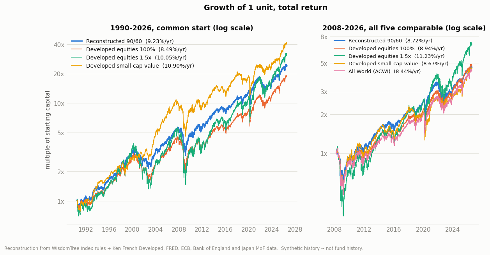
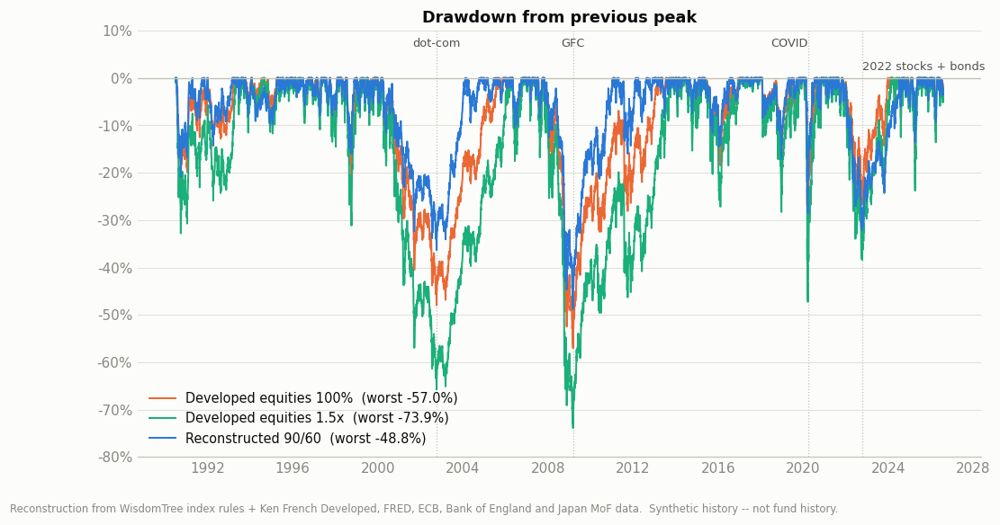
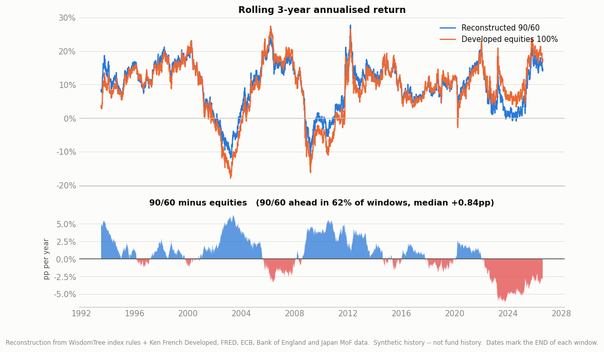
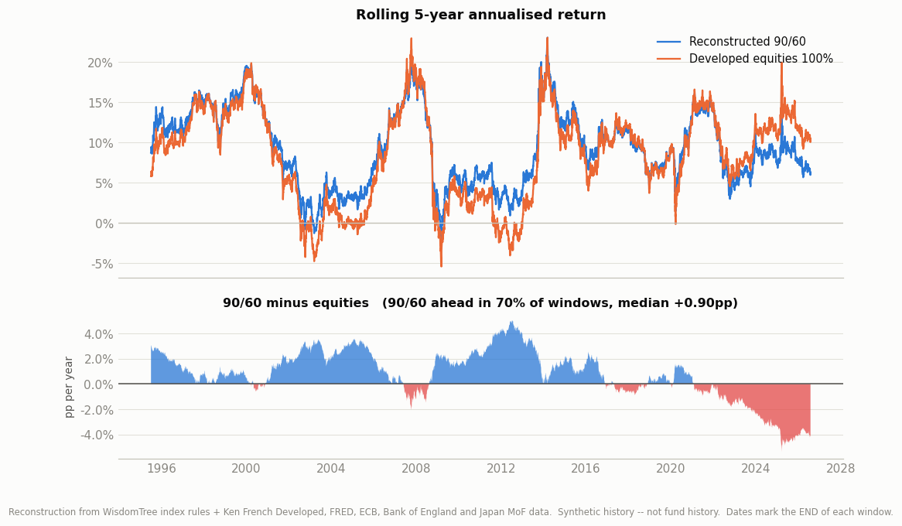
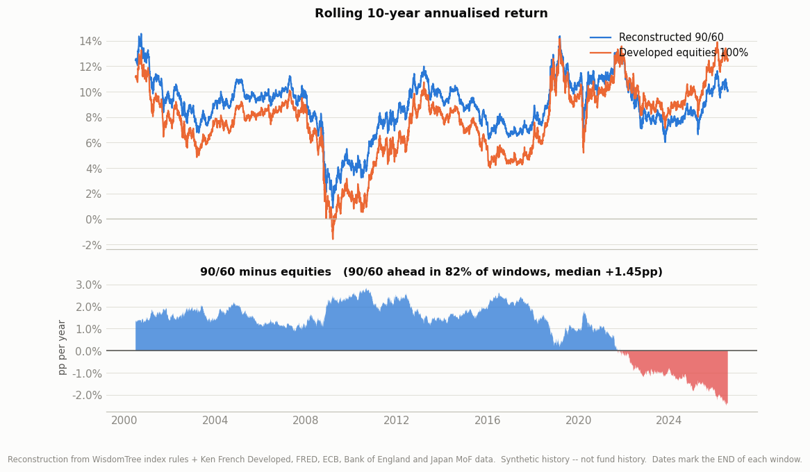
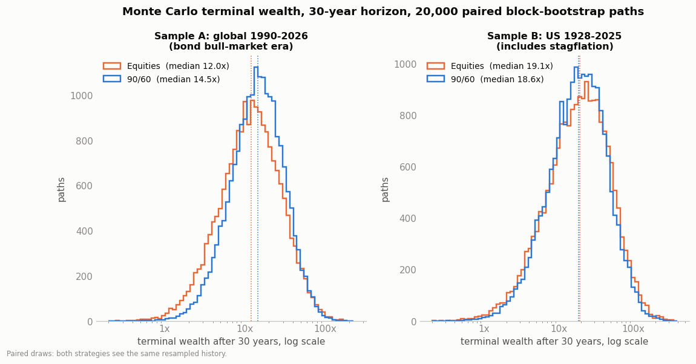
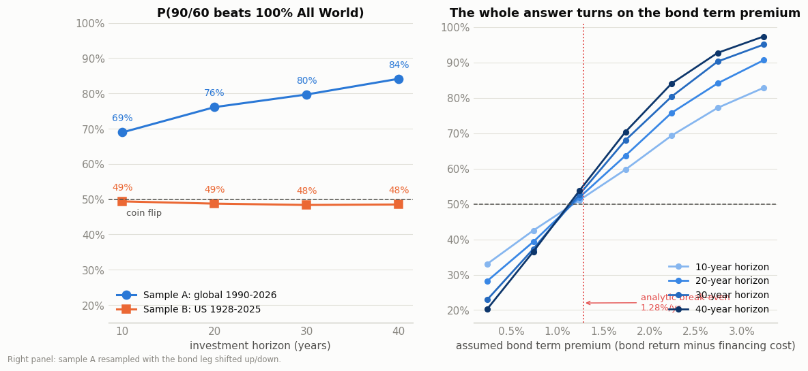
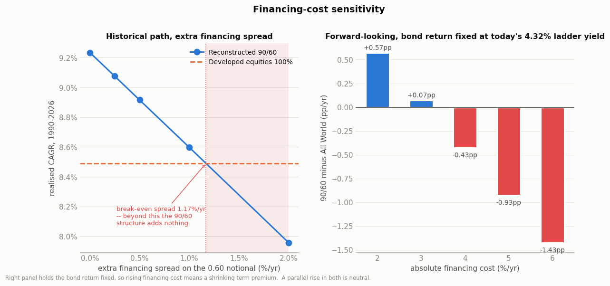
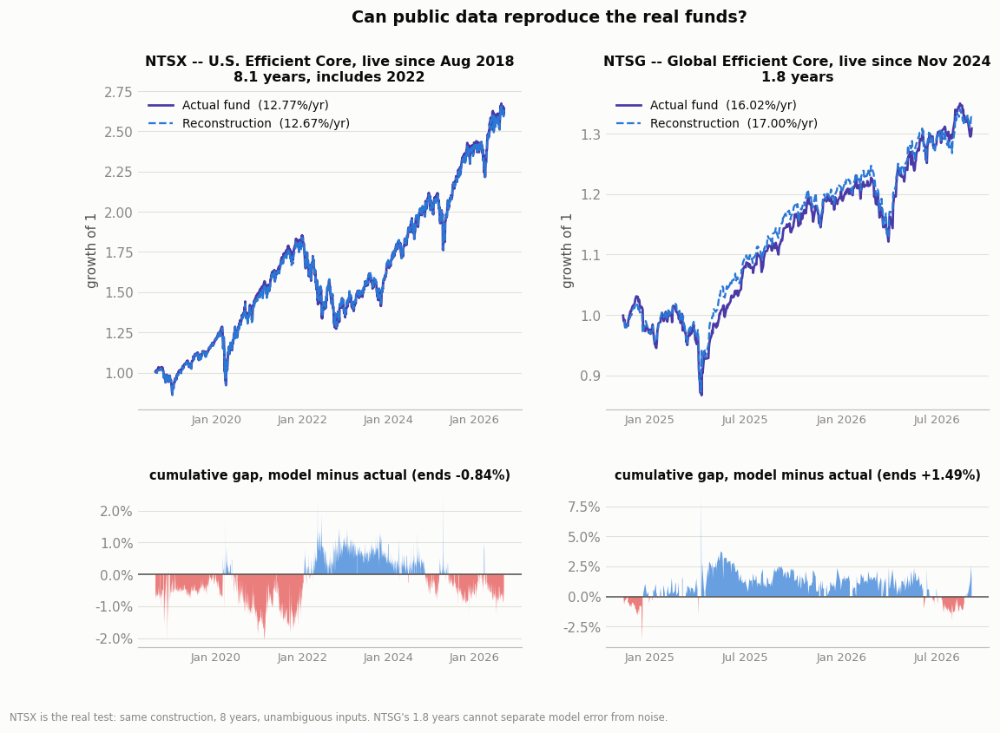

# Do levered bonds pay? The WisdomTree Global Efficient Core (90/60) question

Reconstruction of the WisdomTree Global Efficient Core Index from its published rules,
validated against two live funds, tested over 36 years of global data and 98 years of US
data. Methods, sources and assumptions: [METHODOLOGY.md](METHODOLOGY.md).

**Windows used, stated once so no table below is ambiguous:**

| Series | Window | Nature |
|---|---|---|
| Actual NTSG | 2024-11-08 -> 2026-09-04 (1.8y) | **live fund** |
| Actual NTSX (same construction, US-only) | 2018-08-02 -> 2026-09-04 (8.1y) | **live fund** |
| Global 90/60 reconstruction | 1990-07-03 -> 2026-07-31 (36.1y) | **synthetic** |
| US 90/60 approximation, annual | 1928 -> 2025 (98y) | **synthetic** |

Everything labelled *synthetic* is built from index rules plus primary market data. It is
not fund history and is never presented as such.

---

## The short answer

**Levered bonds are not a return story. They are a risk story, and they only pay at all
when the bond term premium clears a low but real bar.**

The whole structure reduces to one identity. Holding 0.90 equity + 0.10 cash + 0.60 bond
futures, and using the fact that a futures position earns the bond return minus the local
short rate:

```
r(90/60) - r(100% equities) = 0.60 x BOND TERM PREMIUM
                            - 0.10 x EQUITY RISK PREMIUM
                            - costs
```

The fund is not betting that bonds beat equities. It gives up **one tenth** of the equity
risk premium to buy **six tenths** of the bond term premium. Because of that 6:1
multiplier, the break-even is low: with a 5% equity risk premium and the fund's documented
0.27%/yr of costs, the bond term premium only has to exceed **1.28%/yr**.

Whether it clears that bar is entirely period-dependent:

| Sample | Bond term premium | 90/60 CAGR | Equities CAGR | Difference |
|---|---:|---:|---:|---:|
| Global 1990-2026 (36y) | +2.30% | 9.27% | 8.49% | **+0.78pp** |
| US 1928-2025 (98y) | +1.41% | 9.99% | 10.02% | **-0.02pp** |

Over 36 years of global data the bond leg cleared the bar comfortably and 90/60 won. Over
98 years of US data — which includes a rate-rise era and a real stagflation — the return
race is a **dead heat**. The 1990-2026 window is not neutral evidence: it is very close to
the greatest bond bull market in recorded history.

**But the risk result survives both samples**, and that is the actual finding:

| | Global 1990-2026 | | US 1928-2025 | |
|---|---:|---:|---:|---:|
| | equities | 90/60 | equities | 90/60 |
| CAGR | 8.49% | **9.27%** | **10.02%** | 9.99% |
| Volatility | 14.67% | **13.01%** | 19.40% | **18.16%** |
| Sharpe | 0.45 | **0.55** | 0.428 | **0.441** |
| Max drawdown | -57.0% | **-48.8%** | -64.8% | **-59.7%** |

**Verdict: yes, but as a risk-management structure, not as a return enhancer — and only
while the yield curve is upward-sloping and stocks and bonds are not positively
correlated.** Full verdict in [section 13](#13-the-verdict).

---

## 1. What the ETF actually is

Established from WisdomTree's own documents, not from the "90/60" label.

| | |
|---|---|
| Fund | WisdomTree Global Efficient Core UCITS ETF - USD Acc |
| ISIN / tickers | IE00077IIPQ8 / NTSG (LSE USD, Xetra, Borsa Italiana, SIX, Euronext), WGEC (LSE GBP) |
| Inception | 2024-11-05; first listing 2024-11-12/13 |
| Index | WisdomTree Global Efficient Core Index (NTR), Bloomberg `WTNTSGN`, provider WisdomTree Inc. |
| Replication | **Physical (optimised)** — real shares plus listed futures, not a swap |
| TER | **0.25%** |
| Transaction costs | **0.02%** (KID, 07/11/2025) |
| Total ongoing cost | **0.27%/yr** — no performance fee |
| Base currency | USD, accumulating |

### The equity sleeve (90%)

Not a licensed third-party index. WisdomTree builds it:

- **Universe:** companies incorporated, domiciled and listed in 22 developed markets (US,
  Canada, Japan, Australia, Israel, Hong Kong, Singapore, and 15 European markets).
- **Selection:** the **top 1,500 by market capitalisation** meeting a $100k 3-month median
  daily volume screen; common stock, REITs, tracking stocks and holding companies.
- **ESG exclusions** (Sustainalytics data): UN Global Compact violators, controversial
  weapons, tobacco, thermal coal, unconventional oil and gas, small arms.
- **Weighting:** free-float market cap, **10% single-stock cap**, plus a liquidity
  adjustment forcing each stock's volume factor to at least $400m.
- **Weights rebalanced annually in December.**

Actual country weights (factsheet, 31/07/2026): US 69.32%, Japan 6.08%, France 3.25%,
UK 3.02%, Canada 2.98%, Switzerland 2.58%, Germany 2.47%, Netherlands 1.58%,
Australia 1.57%, Spain 1.39%. Top holdings are Nvidia 5.04%, Apple 4.69%, Alphabet 4.19%.

This is, in substance, **MSCI World with an ESG screen and a 10% cap** — a developed-market
large-cap index, *not* an All-World index. It holds no emerging markets. That matters for
the comparison and is why this study benchmarks against both MSCI World-like developed
equities and ACWI.

### The bond sleeve (60% notional)

- **8 government bond futures contracts**, in USD, EUR, GBP and JPY, laddered across the
  **2- to 30-year** segments.
- **Currency group weights match the equity component's currency weights, rescaled** to
  those four currencies. This is the detail most summaries miss: the bond sleeve is not
  equal-weighted by country, it inherits the equity sleeve's ~78% USD tilt.
- **Equal weighted within each currency.**
- **Roll:** front month into second-near, over a one-day window, on the last business day
  of February, May, August and November.

### Cash (10%)

Held across the same four currencies, in the same weights as the bond sleeve, rebalanced
quarterly. It is collateral for the futures, and — because it is not FX-hedged — it is
also a small (~2% of NAV) unhedged foreign-currency position.

### Rebalancing

Back to 90/60/10 on the **last business day of February, May, August and November**, plus
an **exceptional rebalance whenever the equity or bond weight drifts more than 5
percentage points** from target. In the 36-year reconstruction the realised equity weight
wandered between 0.861 and 0.936 and the bond weight between 0.526 and 0.702 — so the
"90/60" is a target, not a constant, and this study models the drift rather than assuming
it away.

### There is no explicit financing cost — and that is the key structural fact

The fund does not borrow at a quoted rate. It holds futures, and a futures price already
embeds the local money-market rate. So the financing cost is not a free parameter the
manager chooses; **it is whatever short rates are**, and the fund's return on the bond leg
is by construction *bond return minus local short rate*. What the fund can additionally
lose is the futures **basis** — a spread over the short rate — plus roll costs. Section 8
prices both.

---

## 2. The model, and how far it can be trusted

The reconstruction implements the rules above literally: drifting weights, the documented
rebalance dates, the 5pp exceptional trigger, four-currency cash with unhedged FX, and
0.27%/yr of costs. Bond futures are built as constant-maturity par bonds repriced off each
day's real yield curve, **including roll-down** (repricing the aged bond at its own
maturity rather than at the headline tenor — worth ~0.4pp/yr on a 7-10y position, and
omitting it is a common and material modelling error).

**Sanity check on the bond engine.** Synthetic constant-maturity Treasuries versus the real
thing:

| ETF | Bucket | Synthetic CAGR | ETF CAGR | Difference | Correlation |
|---|---|---:|---:|---:|---:|
| SHY | 1-3y | 2.32% | 1.97% | +0.35pp | 0.900 |
| IEI | 3-7y | 3.13% | 2.83% | +0.30pp | 0.954 |
| IEF | 7-10y | 3.72% | 3.47% | +0.25pp | 0.963 |
| TLT | 20y+ | 3.82% | 3.54% | +0.29pp | 0.950 |

The synthetic runs **+0.25 to +0.35pp/yr rich across every maturity** — a level effect, not
a duration error. About 0.15pp of it is those ETFs' own expense ratio, which a futures
position does not pay. The remaining ~0.15pp is a known upward bias in the model, carried
forward honestly rather than tuned away.

### Test 1 — NTSX, the real replication test (8.1 years, includes 2022)

NTSX is the same construction, US-only, live since August 2018. Every input is
unambiguous. This is where the replication claim is earned.

| Ladder | Sleeve duration | Model CAGR | Actual CAGR | Gap | Weekly corr | Weekly TE |
|---|---:|---:|---:|---:|---:|---:|
| cheapest-to-deliver 2 / 4.5 / 7 / 18 (**base case**) | 6.53y | 12.73% | 12.72% | **+0.02pp/yr** | 0.987 | 2.84%/yr |
| nominal 2 / 5 / 10 / 30 | 8.54y | 12.50% | 12.72% | -0.21pp/yr | 0.984 | 3.07%/yr |

The base case was chosen **before** looking at fit, on the grounds that a bond future
tracks the cheapest bond in its delivery basket (the 10-year Note future delivers a ~7-year
note), and that this reproduces the ~7-year sleeve duration WisdomTree publishes. It
happens to also fit better. NTSX's beta to SPY is 0.891, against the 0.90 the spec implies.

**Over eight years including the worst bond year in a century, the reconstruction
reproduces the real fund to 2 basis points a year.**

### Test 2 — NTSG itself (1.8 years)

| Equity proxy | Model CAGR | Actual CAGR | Gap | Weekly corr |
|---|---:|---:|---:|---:|
| URTH (iShares MSCI World) | 17.06% | 16.11% | +0.95pp/yr | 0.867 |
| Ken French Developed market | 15.11% | 16.51% | -1.41pp/yr | 0.892 |

The two available developed-market proxies **bracket** the fund and differ from each other
by ~1pp/yr — more than the model gap itself. With 1.8 years of data this cannot be
resolved further, and it does not need to be: NTSX carries the replication claim.

**Largest sources of tracking error, in order:**
1. **The equity sleeve.** NTSG applies ESG screens and a 10% cap to a 1,500-stock universe;
   no public proxy replicates that.
2. **Bond currency weights** are an estimate derived from the fund's published country
   weights (USD 78.1%, EUR 11.7%, JPY 6.8%, GBP 3.4%), since the exact split is not
   published. Section 11 shows this is worth only ~0.04pp/yr.
3. **The exact 8 futures contracts** are not enumerated in the public methodology.
4. **Non-synchronous closes.** NTSG closes in London/Frankfurt hours before US markets, so
   *daily* correlation with US-close data is only ~0.39. Weekly returns fix this (0.87).
   This affects tracking error, not cumulative return.

### A data discrepancy that is reported, not resolved

WisdomTree's marketing factsheet of 31/07/2026 shows, under a table headed "(USD)":
YTD 7.14%, 1-year 16.80%, since-inception 14.83% p.a. **Those figures do not reconcile with
the fund's own price history in any of its three listing currencies, nor with justETF's
independent NAV series.** The price data used here is sound and was verified: the Xetra EUR
line returns +20.31% cumulative from inception to 31/07/2026, matching justETF's
independent NAV figure of +20.31% exactly, and the three listings agree with each other
once converted. This study uses the price-derived series, which two independent sources
agree on. The discrepancy in the marketing document is flagged rather than reconciled away.

---

## 3. Table 1 — return and risk

### (a) Common window, all five strategies: 2008-03-31 -> 2026-07-31 (18.3 years)

| Strategy | CAGR | Volatility | Sharpe | Max DD | Sortino | Calmar |
|---|---:|---:|---:|---:|---:|---:|
| Global equities, All World (ACWI) | 8.44% | 20.13% | 0.44 | -56.28% | 0.61 | 0.15 |
| Developed equities (what NTSG tracks) | 8.94% | 16.49% | 0.52 | -54.46% | 0.72 | 0.16 |
| Developed equities, 1.5x levered | 11.93% | 24.55% | 0.53 | -70.35% | 0.73 | 0.17 |
| Developed small-cap value | 8.67% | 14.69% | 0.55 | -52.26% | 0.75 | 0.17 |
| **Reconstructed 90/60** | **8.75%** | **14.43%** | **0.56** | **-47.63%** | **0.78** | **0.18** |

### (b) Longest window available to each series — **rows are NOT comparable to each other**

| Strategy | Window | Years | CAGR | Volatility | Sharpe | Max DD | Sortino | Calmar |
|---|---|---:|---:|---:|---:|---:|---:|---:|
| All World (ACWI) | 2008-2026 | 18.3 | 8.44% | 20.13% | 0.44 | -56.28% | 0.61 | 0.15 |
| Developed equities | 1990-2026 | 36.1 | 8.49% | 14.67% | 0.45 | -57.03% | 0.63 | 0.15 |
| Developed equities 1.5x | 1990-2026 | 36.1 | 10.45% | 21.85% | 0.44 | -73.33% | 0.62 | 0.14 |
| Developed small-cap value | 1990-2026 | 36.1 | 10.90% | 12.39% | **0.69** | -57.85% | 0.95 | 0.19 |
| **Reconstructed 90/60** | 1990-2026 | 36.1 | 9.27% | 13.01% | 0.55 | -48.79% | 0.77 | 0.19 |

### (c) The live fund, over its own 1.8 years — **not comparable to (a) or (b)**

| Strategy | CAGR | Volatility | Sharpe | Max DD | Sortino | Calmar |
|---|---:|---:|---:|---:|---:|---:|
| **Actual NTSG (live)** | 16.42% | 14.14% | 0.87 | -15.51% | 1.26 | 1.06 |
| Reconstructed 90/60, same window | 14.40% | 12.70% | 0.82 | -13.49% | 1.16 | 1.07 |
| Developed equities, same window | 16.93% | 13.58% | 0.93 | -16.00% | 1.33 | 1.06 |

Rolling 1/3/5/10-year returns are **not reportable for the actual fund** — it has 1.8 years
of history. Rolling analysis (section 9) uses the reconstruction.

**Note on small-cap value.** Over the full 36 years, developed small-cap value has both the
highest CAGR (10.90%) and the highest Sharpe (0.69) of anything here. It is a different
question from the one asked — it is an equity factor bet, not a leverage structure — but it
is worth recording that the best risk-adjusted result in this study did not come from
leverage at all.

---

## 4. Annualised return across explicit windows

Rows use **different windows** and must not be compared vertically. `n/a` means the series
does not span that window at all — it is never silently swapped for a shorter period.

| Window | ACWI | Developed eq. | Dev. eq. 1.5x | Dev. SCV | Reconstr. 90/60 | Actual NTSG |
|---|---:|---:|---:|---:|---:|---:|
| Full reconstruction 1990-2026 | n/a | 8.49% | 10.45% | 10.90% | 9.27% | n/a |
| Since ACWI exists 2008-2026 | 8.44% | 8.92% | 11.89% | 8.68% | 8.74% | n/a |
| Since NTSX exists 2018-2026 | 11.98% | 11.98% | 16.13% | 9.83% | 9.90% | n/a |
| Since NTSG exists 2024-2026 | 17.86% | 16.85% | 22.92% | 25.21% | 14.34% | 16.42% |

### Sub-periods — why the 36-year average must not be read as a stable result

| Sub-period | Equities | 90/60 | Difference | **Bond leg** | 90/60 vol | Equity vol |
|---|---:|---:|---:|---:|---:|---:|
| 1990-1999 | 12.04% | 13.33% | +1.30pp | +3.50% | 10.85% | 11.30% |
| 2000-2009 | 1.38% | 3.83% | **+2.45pp** | +3.58% | 14.79% | 17.16% |
| 2010-2019 | 9.72% | 10.71% | +0.99pp | +3.16% | 10.94% | 13.00% |
| 2020-2026 | 12.87% | 9.85% | **-3.02pp** | **-2.50%** | 15.62% | 17.07% |

The bond-leg column is the excess return on 1.0 of notional. **It alone determines the sign
of the difference column.** In the three decades when it was around +3.5%, 90/60 won; since
2020, when it turned negative, 90/60 lost by 3pp a year.

---

## 5. Why levered bonds can work — the algebra, then the measurement

Measured over the 36-year reconstruction:

| | |
|---|---:|
| Developed equity total return | 8.49% p.a. |
| Four-currency cash (the funding rate) | 2.57% p.a. |
| **Equity risk premium (E - C)** | **5.92% p.a.** |
| **Bond term premium (Bd - C), measured** | **+2.30% p.a.** |
| Break-even term premium needed | 1.44% p.a. |

Decomposition of the edge:

| Component | Contribution |
|---|---:|
| +0.60 x bond term premium | **+1.38 pp** |
| -0.10 x equity risk premium | -0.59 pp |
| -costs | -0.27 pp |
| **Predicted edge over 100% equities** | **+0.52 pp** |
| Actually realised (CAGR difference) | +0.78 pp |

The two differ only by rebalancing and compounding effects.

### Break-even table

Bond term premium required for 90/60 to match 100% equities:

| Equity risk premium -> | 2% | 3% | 4% | 5% | 6% | 7% |
|---|---:|---:|---:|---:|---:|---:|
| costs 0.00%/yr | 0.33% | 0.50% | 0.67% | 0.83% | 1.00% | 1.17% |
| **costs 0.27%/yr (the fund)** | 0.78% | 0.95% | 1.12% | **1.28%** | 1.45% | 1.62% |
| costs 0.50%/yr | 1.17% | 1.33% | 1.50% | 1.67% | 1.83% | 2.00% |

At what term premium does the bond leg turn from asset to liability (5% ERP, 0.27% costs)?

| Term premium | Bond leg contribution | Net vs equities | Verdict |
|---:|---:|---:|---|
| -1.00% | -0.60 pp | -1.37 pp | **negative** |
| -0.50% | -0.30 pp | -1.07 pp | **negative** |
| 0.00% | +0.00 pp | -0.77 pp | **negative** |
| +0.50% | +0.30 pp | -0.47 pp | **negative** |
| +1.00% | +0.60 pp | -0.17 pp | roughly neutral |
| +1.50% | +0.90 pp | +0.13 pp | roughly neutral |
| +2.00% | +1.20 pp | +0.43 pp | **positive** |
| +2.50% | +1.50 pp | +0.73 pp | **positive** |
| +3.00% | +1.80 pp | +1.03 pp | **positive** |

**A zero term premium is not neutral — it costs 0.77pp/yr.** The structure needs a
genuinely positively-sloped curve, not merely a non-inverted one.

---

## 6. Table 3 — financing-cost sensitivity

### (a) Historical: an extra financing spread on the 0.60 notional, applied to the 1990-2026 path

| Extra spread | 90/60 CAGR | Vol | Sharpe | vs 100% equities |
|---:|---:|---:|---:|---:|
| 0.00% | 9.27% | 13.01% | 0.55 | +0.78 pp |
| 0.25% | 9.11% | 13.02% | 0.54 | +0.62 pp |
| 0.50% | 8.95% | 13.02% | 0.53 | +0.46 pp |
| 1.00% | 8.63% | 13.02% | 0.51 | +0.14 pp |
| 2.00% | 7.99% | 13.03% | 0.46 | **-0.50 pp** |

**Break-even extra spread: 1.22%/yr.** A 1pp spread costs 0.60pp of return — it is levied
on the full 0.60 notional, not on the 0.50 of net leverage. Realistic listed-futures basis
is far below this (tens of basis points), so the structure has a wide margin of safety
against *implementation* financing cost. Its vulnerability is the term premium, not the
basis.

### (b) Forward-looking: absolute financing cost 2% to 6%

Anchored on today's curves (2026-09-07): weighted ladder yield **4.32%**, weighted short
rate **3.44%**, implied term premium **+0.88%** — already below the 1.28% break-even.
Assumptions: equity total return 7.5%/yr (**estimate**), bond return held at the 4.32%
ladder yield, costs 0.27%/yr (documented).

| Financing cost | 90/60 CAGR | vs All World |
|---:|---:|---:|
| 2.0% | 8.07% | **+0.57 pp** |
| 3.0% | 7.57% | +0.07 pp |
| 4.0% | 7.07% | -0.43 pp |
| 5.0% | 6.57% | -0.93 pp |
| 6.0% | 6.07% | **-1.43 pp** |

`d(return)/d(financing) = 0.10 - 0.60 = -0.50`. Every extra 1pp of financing cost costs
0.50pp, because the fund is 50% net levered. **Crucially, the *level* of rates is
irrelevant — only the spread between the ladder yield and the short rate matters. A
parallel rise in both is neutral.** The table above is therefore a curve-flattening
scenario, not a rate-level scenario.

---

## 7. Sensitivity to bond returns, equity returns, correlation and volatility

### Expected-return grid: 90/60 minus 100% equities, pp/yr

Financing fixed at 3.44%, costs 0.27%.

| Bond return \ Equity return | 4.0% | 5.5% | 7.0% | 8.5% | 10.0% |
|---|---:|---:|---:|---:|---:|
| **0.0%** | -2.39 | -2.54 | -2.69 | -2.84 | -2.99 |
| **1.5%** | -1.49 | -1.64 | -1.79 | -1.94 | -2.09 |
| **3.0%** | -0.59 | -0.74 | -0.89 | -1.04 | -1.19 |
| **4.5%** | +0.31 | +0.16 | +0.01 | -0.14 | -0.29 |
| **6.0%** | +1.21 | +1.06 | +0.91 | +0.76 | +0.61 |

The edge is **almost entirely a function of the bond row**. Moving equities from 4% to 10%
changes the answer by only 0.6pp, because only 0.10 of equity exposure was given up.
Equity return assumptions barely matter; bond return assumptions decide everything.

### Correlation: what it does and does not change

Measured: equity vol 14.67%, bond-futures vol 4.73%, **correlation -0.179**.

| Correlation | 90/60 vol | vs equity vol | 90/60 Sharpe |
|---:|---:|---:|---:|
| -0.60 | 11.72% | -2.95 pp | 0.57 |
| -0.30 | 12.64% | -2.03 pp | 0.53 |
| 0.00 | 13.50% | -1.17 pp | 0.49 |
| +0.30 | 14.31% | -0.36 pp | 0.47 |
| +0.60 | 15.08% | **+0.41 pp** | 0.44 |
| +0.90 | 15.80% | **+1.14 pp** | 0.42 |

(100% equities: vol 14.67%, Sharpe 0.45.)

**Correlation does not enter the expected-return identity at all.** It decides only whether
the extra 0.60 of bond exposure is bought cheaply in risk terms. At rho >= +0.6 the 90/60
portfolio is *riskier* than 100% equities and the structure loses its entire rationale.

This is not hypothetical. Rolling 3-year stock/bond correlation, by year:

```
1993 +0.24   1997 +0.27   2001 -0.13   2005 -0.27   2009 -0.38   2013 -0.51
2017 -0.33   2020 -0.41   2021 -0.39   2022 -0.26   2023 +0.05   2024 +0.13
2025 +0.12   2026 +0.09
```

Correlation was **positive through the 1990s**, turned negative from 1999 to 2022, and
**has turned positive again since 2023**. The diversification benefit the fund's own
methodology cites ("the historically negative correlation between stocks and bonds") is a
property of one particular monetary regime, not a law.

### Volatility drag

| Strategy | Arithmetic mean | Geometric (CAGR) | Drag |
|---|---:|---:|---:|
| 100% equities | 9.23% | 8.49% | 0.74 pp |
| **1.5x equities** | 12.34% | 10.45% | **1.89 pp** |
| 90/60 | 9.68% | 9.27% | **0.45 pp** |

The 1.5x equity portfolio loses the most to variance drag: the same premium, much more
variance. **This is the case against levering equities and the case for levering a
low-volatility, low-correlation asset** — and it is why 1.5x equity, despite a much higher
CAGR, ends up with a *lower* Sharpe (0.44) than 90/60 (0.55) and a -73% drawdown.

---

## 8. Rolling analysis

| Window | Periods | 90/60 wins | Median difference | 5th pct | 95th pct | Worst | Best |
|---|---:|---:|---:|---:|---:|---:|---:|
| 1 year | 9,154 | 53.9% | +0.67pp | -6.21pp | +7.14pp | -13.23pp | +9.48pp |
| 3 years | 8,632 | 63.2% | +0.87pp | -4.66pp | +4.81pp | -6.14pp | +6.36pp |
| 5 years | 8,110 | 71.1% | +0.95pp | -3.34pp | +3.56pp | -5.32pp | +5.06pp |
| 10 years | 6,806 | 81.6% | +1.49pp | -1.52pp | +2.45pp | -2.44pp | +2.89pp |

Outperformance is **persistent but not uniform, and the failures cluster**. Sustained
spells (3 months or more) in which 90/60 trailed over the trailing 5 years:

| Spell (window end-date) | Length | Worst |
|---|---:|---:|
| 2007-05 .. 2008-07 | 1.2y | -2.01pp/yr |
| 2017-04 .. 2018-08 | 1.3y | -0.85pp/yr |
| 2021-02 .. 2021-12 | 0.8y | -0.97pp/yr |
| **2021-12 .. 2026-07** | **4.6y** | **-5.32pp/yr** |

The last block is live and ongoing: the 2022 bond crash is still inside every trailing
5-year window, and 90/60 has been behind on that measure for four and a half years. On the
10-year measure it has been behind since 2022 as well. **Anyone buying this structure needs
to be able to sit through underperformance measured in years, not quarters.**

---

## 9. Drawdown analysis

Cumulative return through each named episode:

| Episode | Window | 100% equities | 1.5x equities | **90/60** | Small-cap value |
|---|---|---:|---:|---:|---:|
| Dot-com bust | 2000-03 .. 2002-10 | -38.0% | -55.2% | **-25.6%** | +1.5% |
| Global Financial Crisis | 2007-10 .. 2009-03 | -48.3% | -65.1% | **-38.9%** | -49.1% |
| Euro crisis | 2011-05 .. 2011-10 | -12.4% | -19.3% | **-6.5%** | -15.1% |
| COVID crash | 2020-02 .. 2020-03 | -33.4% | -46.2% | **-28.2%** | -36.9% |
| **2022 stocks + bonds** | 2022-01 .. 2022-10 | -20.3% | -28.5% | **-26.7%** | **-13.4%** |
| 2025 tariff shock | 2025-02 .. 2025-04 | -5.4% | -9.6% | **-3.2%** | -1.5% |
| **Full-sample max drawdown** | 1990-2026 | -57.0% | -73.3% | **-48.8%** | -57.8% |

**The answer to "does 90/60 reduce drawdown, or just create a different kind of risk?" is
both.** In five of six episodes it cut the loss materially — 12pp in the dot-com bust, 9pp
in the GFC, 6pp in the Euro crisis. In 2022, the one episode where bonds fell alongside
equities, **it lost more than unlevered equities did** (-26.7% vs -20.3%). That is the
structure's specific failure mode, and it is not a tail scenario invented for this report:
it happened three years ago.

Recovery time is the under-appreciated benefit:

| | Peak -> trough | Depth | Months to recover |
|---|---|---:|---:|
| **Equities**, GFC | 2007-11 -> 2009-03 | -57.03% | **48.2** |
| **90/60**, GFC | 2007-11 -> 2009-03 | -48.79% | **22.8** |
| **Equities**, dot-com | 2000-03 -> 2002-10 | -47.97% | **34.9** |
| **90/60**, dot-com | 2000-03 -> 2002-10 | -36.30% | **16.3** |
| **Equities**, 2022 | 2021-11 -> 2022-10 | -26.69% | 14.5 |
| **90/60**, 2022 | 2021-11 -> 2022-10 | **-32.04%** | **21.1** |

After the GFC, 90/60 was whole in under two years while equities took four.

---

## 10. Market regimes

### Global reconstruction, 1990-2026, monthly

Return columns are annualised *within* each bucket — the pace of returns while that state
holds, not a holding-period result. `diff` is the average monthly difference in pp.

| Regime | Months | Equities | 90/60 | Bond leg | diff | 90/60 wins |
|---|---:|---:|---:|---:|---:|---:|
| **A** Equities up | 275 | 47.17% | 43.39% | +1.85% | -0.23pp | 39.3% |
| **B** Equities down + yields falling | 78 | -36.96% | **-25.74%** | +20.47% | +1.31pp | **100.0%** |
| **C** Equities down + yields rising | 77 | -36.05% | **-38.28%** | -12.03% | -0.29pp | 27.3% |
| **D** Inflation high (top quintile) | 87 | -8.17% | -6.58% | +1.17% | +0.12pp | 55.2% |
| **E** Disinflation + falling yields | 106 | 5.57% | **15.49%** | +16.65% | +0.72pp | 82.1% |
| **F** Strong equity bull | 108 | 95.70% | 85.30% | +1.38% | -0.48pp | 29.6% |
| **G** High inflation + equities down | 45 | -43.94% | -40.66% | -0.21% | +0.44pp | 62.2% |

### US 1928-2025, annual — the sample that contains a real stagflation

| Period | Years | Equities | 90/60 | Difference | Avg term premium | 90/60 wins |
|---|---:|---:|---:|---:|---:|---:|
| **1928-2025 full** | 98 | **10.02%** | **9.99%** | **-0.02pp** | +1.41% | 41.8% |
| 1928-1949 | 22 | 4.65% | 5.53% | +0.88pp | +2.25% | 45.5% |
| 1950-1969 | 20 | 13.45% | 11.45% | **-2.00pp** | -1.32% | 25.0% |
| **1970-1981 stagflation** | 12 | 6.91% | 5.31% | **-1.60pp** | **-2.28%** | 25.0% |
| 1982-1999 disinflation bull | 18 | 18.34% | 19.28% | +0.94pp | +4.67% | 55.6% |
| 2000-2019 | 20 | 6.00% | 8.16% | **+2.16pp** | +3.82% | 55.0% |
| 2020-2025 | 6 | 14.92% | 10.88% | **-4.03pp** | -3.01% | 33.3% |

| Inflation regime (US CPI, 1948-2025) | Years | Equities | 90/60 | Difference | Term premium | 90/60 wins |
|---|---:|---:|---:|---:|---:|---:|
| Inflation in the top quintile | 16 | 5.87% | 2.74% | **-3.13pp** | -4.48% | **12.5%** |
| Inflation below median | 39 | 13.49% | 13.76% | +0.27pp | +2.33% | 43.6% |
| **Stagflation (high inflation AND equities down)** | 7 | -11.95% | **-14.94%** | **-2.99pp** | -7.45% | **0.0%** |

**Answering the brief's seven scenarios directly:**

| Scenario | Result | Why |
|---|---|---|
| **A** Bull market, low stable rates | **Underperforms** (-0.23pp/mo) | Only 0.90 equity exposure; bond leg earns roughly cash |
| **B** Equity crash + falling rates | **Strongly outperforms**, 100% win rate | Bonds rally hard; this is the design case |
| **C** Equity crash + rising rates | **Underperforms** (-0.29pp/mo, 27% win) | Both legs fall; leverage amplifies. 2022. |
| **D** Inflationary, rates rising | **Mildly positive in 1990-2026; sharply negative in the long US sample** (-3.13pp/yr, 12.5% win) | The recent sample has no serious inflation |
| **E** Deflation / recession | **Strongly outperforms** (+0.72pp/mo, 82% win) | Falling yields, negative correlation |
| **F** Long equity bull, weak bonds | **Underperforms** (-0.48pp/mo, 30% win) | Gives up equity exposure for a leg earning nothing |
| **G** Stagflation | **Worst case: 0% win rate over 98 years, -2.99pp/yr** | Negative term premium plus positive correlation |

The global 1990-2026 sample says regime G is survivable (+0.44pp/mo); the 98-year US sample
says it is the single worst environment for this structure, with a **zero** win rate. The
1990-2026 window simply contains no genuine stagflation — its "high inflation" months sit
inside a disinflationary era. **The long sample is the authority here.**

Worst single years for the structure over 98 years:

| Year | 90/60 | Equities | Bonds | Bills | Difference |
|---|---:|---:|---:|---:|---:|
| 1931 | -42.41% | -43.84% | -2.56% | 2.31% | +1.42pp |
| 1937 | -31.38% | -35.34% | +1.38% | 0.28% | +3.95pp |
| **2022** | **-28.25%** | -18.04% | **-17.83%** | 2.09% | **-10.21pp** |
| 1974 | -26.31% | -25.90% | +1.99% | 7.85% | -0.41pp |
| 1930 | -22.43% | -25.12% | +4.54% | 4.55% | +2.69pp |

**2022 is the worst relative year in 98 years** — a 10.21pp shortfall in a single year.

---

## 11. Monte Carlo

Stationary block bootstrap, **paired draws** (both strategies see the same resampled
history, so the outperformance probability is a genuine paired probability), 20,000 paths
per horizon. Blocks preserve the persistence of rate cycles that an i.i.d. draw would
destroy.

### Table 2 — outperformance probability

**Sample A — global 1990-2026 (bond bull-market era), 12-month blocks**

| Horizon | P(90/60 > All World) | Median advantage | 5th percentile | 95th percentile |
|---|---:|---:|---:|---:|
| 10 years | **69.9%** | +0.75pp | -1.59pp | +2.96pp |
| 20 years | **77.2%** | +0.75pp | -0.91pp | +2.35pp |
| 30 years | **81.1%** | +0.74pp | -0.62pp | +2.05pp |
| 40 years | **85.5%** | +0.74pp | -0.41pp | +1.88pp |

**Sample B — US 1928-2025 (includes stagflation), 4-year blocks**

| Horizon | P(90/60 > All World) | Median advantage | 5th percentile | 95th percentile |
|---|---:|---:|---:|---:|
| 10 years | **49.4%** | -0.03pp | -2.65pp | +2.48pp |
| 20 years | **48.7%** | -0.04pp | -1.92pp | +1.76pp |
| 30 years | **48.4%** | -0.04pp | -1.57pp | +1.43pp |
| 40 years | **48.5%** | -0.03pp | -1.36pp | +1.24pp |

**The two samples give completely different answers on return, and that disagreement is the
result.** Reporting only Sample A would be the single most misleading thing this study
could do.

### Distributions

**Sample A, by horizon:**

| Horizon | 90/60 CAGR (5/50/95) | Equities CAGR (5/50/95) | Median wealth 90/60 | Median wealth eq. |
|---|---|---|---:|---:|
| 10y | 1.18 / 9.51 / 16.67 | -0.68 / 8.80 / 17.15 | 2.48x | 2.32x |
| 20y | 3.53 / 9.41 / 14.66 | 1.98 / 8.66 / 14.76 | 6.04x | 5.26x |
| 30y | 4.58 / 9.37 / 13.70 | 3.15 / 8.65 / 13.68 | 14.70x | 12.05x |
| 40y | 5.22 / 9.36 / 13.11 | 3.93 / 8.61 / 12.95 | 35.79x | 27.18x |

| Horizon | vol 90/60 | vol eq. | median maxDD 90/60 | eq. | P(lose money) 90/60 | eq. |
|---|---:|---:|---:|---:|---:|---:|
| 10y | 13.40% | 14.77% | -23.8% | -27.4% | 3.05% | 6.25% |
| 20y | 13.52% | 14.89% | -33.6% | -38.5% | 0.47% | 1.75% |
| 30y | 13.56% | 14.92% | -38.6% | -45.3% | 0.10% | 0.51% |
| 40y | 13.55% | 14.93% | -41.6% | -49.3% | 0.01% | 0.17% |

**Sample B, by horizon:**

| Horizon | 90/60 CAGR (5/50/95) | Equities CAGR (5/50/95) | Median wealth 90/60 | Median wealth eq. |
|---|---|---|---:|---:|
| 10y | 0.04 / 10.48 / 18.95 | -0.98 / 10.78 / 19.52 | 2.71x | 2.78x |
| 20y | 3.19 / 10.28 / 16.29 | 2.52 / 10.42 / 16.77 | 7.08x | 7.26x |
| 30y | 4.47 / 10.24 / 15.30 | 3.92 / 10.34 / 15.71 | 18.62x | 19.12x |
| 40y | 5.21 / 10.13 / 14.57 | 4.67 / 10.23 / 15.03 | 47.42x | 49.15x |

| Horizon | vol 90/60 | vol eq. | median maxDD 90/60 | eq. | P(lose money) 90/60 | eq. |
|---|---:|---:|---:|---:|---:|---:|
| 10y | 17.20% | 18.50% | -18.8% | -18.0% | 4.95% | 6.49% |
| 20y | 17.62% | 18.83% | -28.2% | -36.5% | 1.06% | 1.69% |
| 30y | 17.71% | 18.95% | -31.4% | -36.6% | 0.27% | 0.52% |
| 40y | 17.90% | 19.13% | -37.0% | -38.9% | 0.05% | 0.13% |

Even in Sample B, where the return race is a tie, 90/60 has **lower volatility at every
horizon, a lower 5th-percentile drawdown, and a lower probability of losing money**. Note
also that 90/60's 5th-percentile CAGR is *higher* than equities' at every horizon in both
samples — the left tail is genuinely better.

Probability of clearing return thresholds (Sample A / Sample B, 30-year horizon):

| Threshold | 90/60 | Equities |
|---|---|---|
| CAGR > 4% | 96.6% / 96.1% | 91.9% / 94.8% |
| CAGR > 6% | 87.8% / 88.6% | 79.2% / 86.8% |
| CAGR > 8% | 68.7% / 74.6% | 58.1% / 73.2% |

### Monte Carlo sensitivity — the result is only as good as the bond leg

Sample A resampled with the bond term premium shifted, everything else (including the
correlation structure inside each block) unchanged. Sample A's own term premium is +2.30%.

| Shift | Term premium | P(win) 10y | 20y | 30y | 40y | Median adv. 30y |
|---:|---:|---:|---:|---:|---:|---:|
| -2.0% | +0.30% | 34.0% | 29.6% | 24.2% | 21.6% | -0.57pp |
| -1.5% | +0.80% | 43.4% | 40.7% | 39.0% | 38.6% | -0.23pp |
| -1.0% | +1.30% | 52.1% | 53.4% | 54.5% | 55.9% | +0.09pp |
| -0.5% | +1.80% | 60.9% | 65.3% | 69.7% | 72.2% | +0.40pp |
| **0.0%** | **+2.30%** | **70.4%** | **77.0%** | **81.7%** | **85.4%** | **+0.75pp** |
| +0.5% | +2.80% | 78.0% | 85.0% | 91.2% | 93.5% | +1.07pp |
| +1.0% | +3.30% | 83.6% | 91.4% | 95.5% | 97.7% | +1.40pp |

**The simulation crosses 50% at a term premium of ~1.25%, matching the analytic break-even
of 1.28% derived independently in section 5.** Two methods, one answer. Below that, the
structure is a losing bet on expected return and its case rests entirely on risk reduction.

Note the asymmetry: **longer horizons amplify whichever way the term premium points.** At
+2.30% a longer horizon makes winning more likely (70% -> 85%); at +0.30% it makes losing
more likely (34% -> 22%). Time does not rescue a structure whose edge is negative.

---

## 12. Robustness of the modelling choices

| Variant | 90/60 CAGR | Vol | Sharpe | vs equities |
|---|---:|---:|---:|---:|
| **Base case** (CTD ladder, fund currency weights) | 9.27% | 13.01% | 0.55 | +0.78 pp |
| Nominal 2/5/10/30 ladder | 9.52% | 13.01% | 0.56 | +1.03 pp |
| Currency weights: US only | 9.26% | 12.99% | 0.55 | +0.77 pp |
| Currency weights: equal 4-currency | 9.28% | 13.14% | 0.54 | +0.79 pp |
| Currency weights: 1990s Japan-heavy | 9.27% | 13.03% | 0.55 | +0.78 pp |
| Zero costs (the index, not the fund) | 9.56% | 13.01% | 0.57 | +1.07 pp |
| Costs doubled to 0.54%/yr | 8.98% | 13.01% | 0.53 | +0.49 pp |

**The conclusion is insensitive to every modelling choice that had to be estimated.** The
currency-weight estimate — the least certain input — moves the answer by 0.02pp. Only the
ladder duration matters at all (+0.25pp), and the base case is the conservative one.

Bond-sleeve currency coverage grows with the source curves (BoE gilt par yields start 1993,
the ECB euro curve 2004):

| Period | Currencies | Sleeve excess return |
|---|---:|---:|
| 1990-07 .. 1993-10 | 2 (USD, JPY) | +8.31% p.a. |
| 1993-11 .. 2004-09 | 3 (+ GBP) | +2.69% p.a. |
| 2004-09 .. 2026-07 | 4 (+ EUR) | +1.23% p.a. |

Over 2004-2026 a US-only sleeve returns +1.18% against the blend's +1.23%, so the currency
mix is worth +0.05pp on the sleeve and **+0.04pp at fund level**. The 1990-1993 sub-sample
has an unusually high sleeve return on only two currencies; it is 9% of the window and its
influence is visible in the sub-period table in section 4.

---

## 13. The verdict

### Does it pay to lever bonds?

**1. Expected return — NO reliable edge.** Over 98 years of US data the 90/60 structure
returned 9.99% against 10.02% for equities: a dead heat. Over 36 years of global data it
won by 0.78pp/yr, but that window is very nearly the greatest bond bull market in history.
Anyone underwriting this trade on expected return is extrapolating one monetary regime.

**2. Risk-adjusted return — YES, consistently.** This is the one result that holds in every
sample and under every robustness variant. Sharpe 0.55 vs 0.45 over 36 global years; 0.441
vs 0.428 over 98 US years; higher Sortino and Calmar in both. Volatility is 1.5-1.7pp lower
and the 5th-percentile CAGR is higher at every Monte Carlo horizon in both samples.

**3. Drawdown — YES in most crises, NO in the one that matters most.** It cut 12pp off the
dot-com bust, 9pp off the GFC, 6pp off the Euro crisis, and roughly halved recovery times.
But in 2022 it lost **more** than unlevered equities (-26.7% vs -20.3%), and 2022 was its
worst relative year in 98 years (-10.21pp). It does not remove risk; it **exchanges equity
risk for duration risk**, and duration risk shows up exactly when inflation does.

**4. Diversification — YES, but it is rented, not owned.** The entire benefit rests on
stock/bond correlation. At rho <= 0 the structure is less risky *and* higher returning; at
rho >= +0.6 it is riskier than plain equities and pointless. Correlation was positive
through the 1990s, negative 1999-2022, and **has been positive again since 2023**. The
fund's own methodology cites "the historically negative correlation between stocks and
bonds" — that is a regime property, not a constant.

**5. Financing costs — NOT the binding constraint.** Because the leverage comes from
futures, financing is the local short rate, and the break-even *extra* spread is 1.22%/yr —
far above any realistic listed-futures basis. The fund's 0.27%/yr total cost is genuinely
low and doubling it still leaves +0.49pp over the 36-year sample. **The vulnerability is
the term premium, not the fee or the basis.**

**6. Sequence and path dependency — a real cost.** 90/60 trailed on 29% of all rolling
5-year windows, and the failures cluster: it has been behind on the trailing 5-year measure
continuously since December 2021, and on the 10-year measure since 2022. That is four and a
half years of underperformance and counting. The structure requires the temperament to hold
through it.

**7. Macro regimes — a clean, predictable map.**
- **Wins:** equity drawdowns with falling yields (100% win rate), disinflation, recessions.
- **Loses:** strong equity bull markets, rising-rate environments, high inflation, and
  above all **stagflation — 0% win rate over 98 years, -2.99pp/yr.**

### Does 90/60 offer a better risk-adjusted portfolio than 100% global equities?

**Yes — modestly, and more reliably than it offers a better return.** Every risk-adjusted
measure favours it in both samples, but the margin over 98 years is small (Sharpe 0.441 vs
0.428). The stronger and more robust claim is the *shape* of the outcome: similar or
slightly better return with meaningfully less volatility, shallower typical drawdowns,
faster recoveries, and a better left tail.

Note also that over the same 36 years, **developed small-cap value delivered both a higher
CAGR (10.90%) and a higher Sharpe (0.69)** than the 90/60 structure. If the objective is
risk-adjusted return rather than leverage specifically, that is a live alternative — and a
reminder that this structure is not the only, or historically the best, route to the goal.

### At what parameters does levering bonds stop making sense?

| Parameter | Sensible | Marginal | Not sensible |
|---|---|---|---|
| **Bond term premium** (the decisive variable) | > +2.0% | +1.0% to +1.5% | **< +1.0%** |
| **Extra financing spread** | < 0.5% | ~1.2% | > 1.2% |
| **Equity/bond correlation** | <= 0 | 0 to +0.3 | **>= +0.6** |
| **Equity risk premium** | almost irrelevant | — | very high ERP raises the bar slightly |
| **Fund costs** | <= 0.30% | ~0.5% | > 0.9% |

Break-even bond term premium = **(equity risk premium / 6) + (costs / 0.6)**. With a 5% ERP
and 0.27% costs, that is **1.28%/yr**.

### Where does that leave the decision today?

Today's weighted ladder yield is **4.32%** against a weighted short rate of **3.44%** — an
implied term premium of **+0.88%**, which is **below the 1.28% break-even**. On today's
curve, on these assumptions, the bond leg is priced to subtract roughly 0.2-0.3pp a year
from expected return rather than add to it. And stock/bond correlation has been positive
since 2023, which is the state in which the risk benefit also weakens.

**That does not make the structure wrong** — an 0.88% term premium is a starting condition,
not a forecast, and curves steepen. But it means the honest case for NTSG today is a
**risk-management case made in an unfavourable starting environment**, not a
"free-lunch capital efficiency" case. It is a reasonable *component* of a long-horizon
portfolio for an investor who specifically wants duration diversification, is untroubled by
multi-year relative underperformance, and understands that the position loses on both legs
in an inflation shock. It is not a strict improvement on holding global equities, and the
evidence does not support treating it as one.

---

## Charts

| | |
|---|---|
|  |  |
|  |  |
|  |  |
|  |  |
|  | |

1. `c1_cumulative_wealth.png` — growth of 1, two panels (the five series do not share a start date)
2. `c2_rolling_3y.png`, 3. `c3_rolling_5y.png`, 4. `c4_rolling_10y.png` — rolling CAGR and the difference
5. `c5_drawdown.png` — drawdown from previous peak
6. `c6_mc_terminal_wealth.png` — Monte Carlo terminal wealth, both samples
7. `c7_prob_outperform.png` — P(90/60 > All World) by horizon, and versus the term premium
8. `c8_financing_sensitivity.png` — historical spread and forward-looking financing cost
9. `c9_actual_vs_model.png` — NTSX and NTSG, actual versus reconstruction
